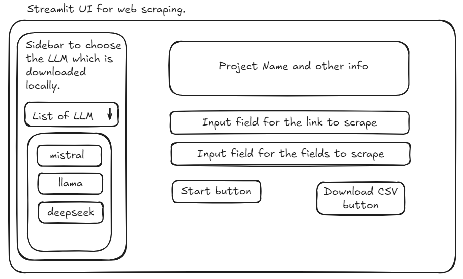
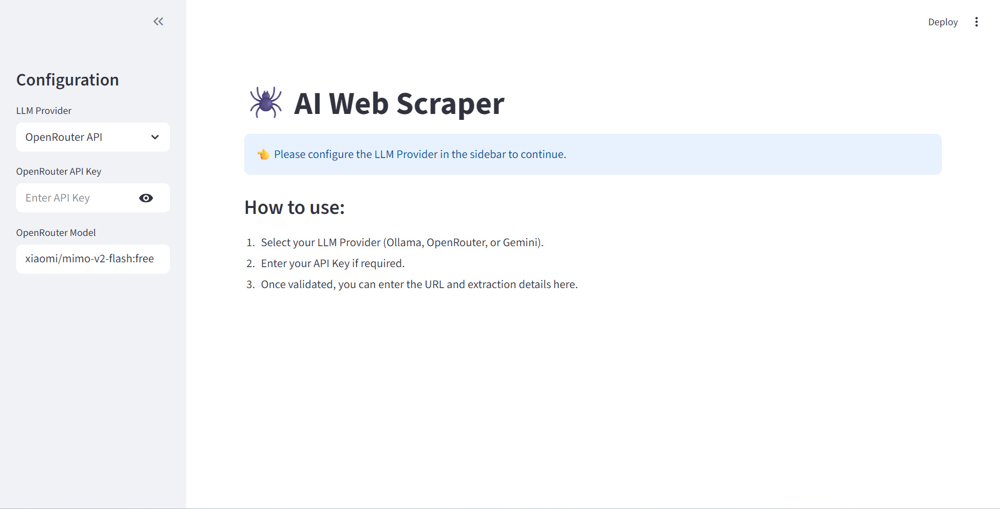
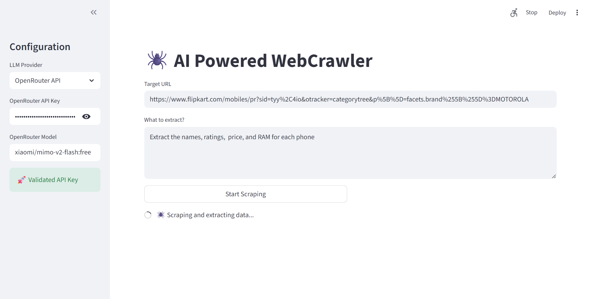
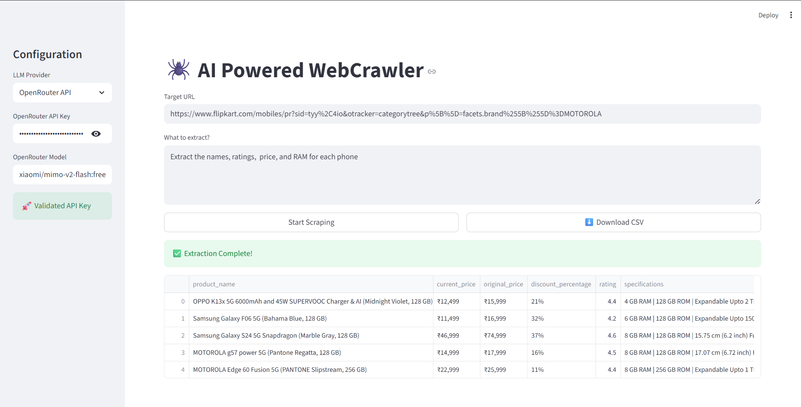

# 🕷️ AI Powered Web Scraper

A powerful, modular web scraping application built with **Streamlit**, **LangChain**, and **Crawl4AI**. This tool leverages Large Language Models (LLMs) to intelligently extract structured data from websites based on natural language user prompts.

---

## 🚀 Features

-   **AI-Powered Extraction**: Describe what you want to extract in plain English (e.g., "Extract all product names and prices"), and the AI handles the rest.
-   **Multi-Provider Support**: Seamlessly switch between:
    -   **Ollama** (Local LLMs like Llama 3, Mistral)
    -   **Gemini API** (Google's multimodal models)
    -   **OpenRouter API** (Access to various top-tier models)
-   **Dynamic Schema Generation**: Automatically creates Pydantic models on the fly to ensure structured, consistent data output.
-   **Robust Backend**: Uses `Crawl4AI` for efficient web crawling and `LangChain` for orchestration.
-   **User-Friendly Interface**: Clean and responsive UI built with Streamlit.
-   **Data Export**: Download extracted data directly as CSV.

---

## 📂 Project Structure

```text
web_scraping_project/
├── .streamlit/             # Streamlit configuration
├── app/
│   ├── ui/                 # Frontend components (Sidebar, Main Page)
│   └── backend/            # Core logic (Scraper, LLM Service, Data Pipeline)
├── data/
│   └── output/             # Extracted CSV files
├── testing/                # Unit examinations for responses
├── pyproject.toml          # Project dependencies
└── README.md               # You are here
```

---

## 🛠️ Technology Stack

-   **Frontend**: Streamlit
-   **Orchestration**: LangChain (LCEL), LangGraph
-   **Crawling**: Crawl4AI
-   **LLMs**: Ollama, Google Gemini, OpenRouter
-   **Dependency Management**: UV

---

## 📦 Installation

### Prerequisites

-   Python 3.12+
-   [Ollama](https://ollama.com/) (if using local models)

### Using UV (Recommended)

This project uses `pyproject.toml` for dependency management.

1.  **Clone the repository**:
    ```bash
    git clone https://github.com/OmPatil44/web_scraping.git
    cd web_scraping
    ```

2.  **Install dependencies**:
    ```bash
    uv sync
    ```

3.  **Run the application**:
    ```bash
    uv run streamlit run app/ui/main.py
    ```

---

## 💡 Usage

1.  **Launch the App**: Run the streamlit command mentioned above.
2.  **Configure Sidebar**:
    -   Select your **LLM Provider** (Ollama, Gemini, or OpenRouter).
    -   Enter your **API Key** (if required).
    -   Select your **Model**.
    -   Wait for the "Validated API Key" or check status.
3.  **Scrape Data**:
    -   Enter the **Target URL** (e.g., `https://books.toscrape.com/`).
    -   Enter your **Extraction Prompt** (e.g., "Get the title, price, and rating of all books on this page").
    -   Click **Start Scraping**.
4.  **Download**: Once finished, preview the data and click **Download CSV**.

---

## 🤝 Contributing

Contributions are welcome! Please check the templates for bug or feature reporting.

---

## Project ScreenShots

### Expected UI Design


---

### Homepage


---

### Scraping


---

### Final Result

